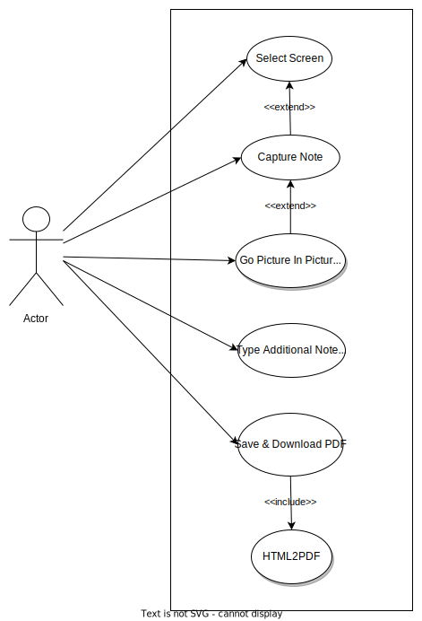
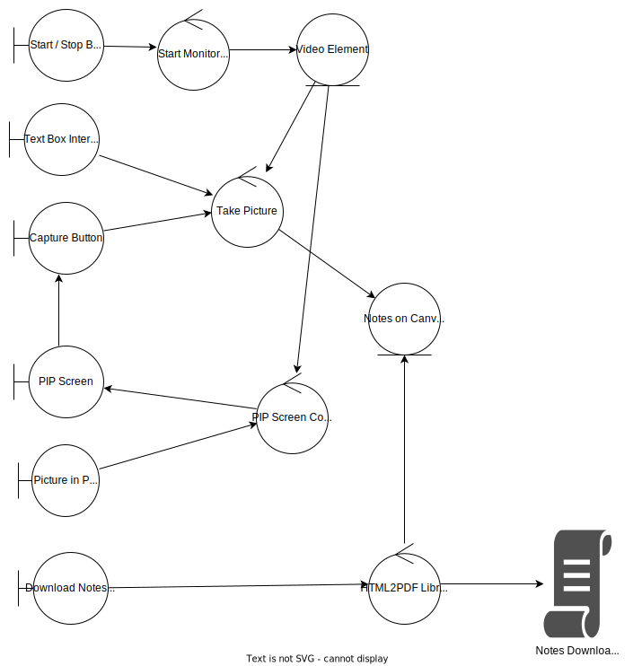
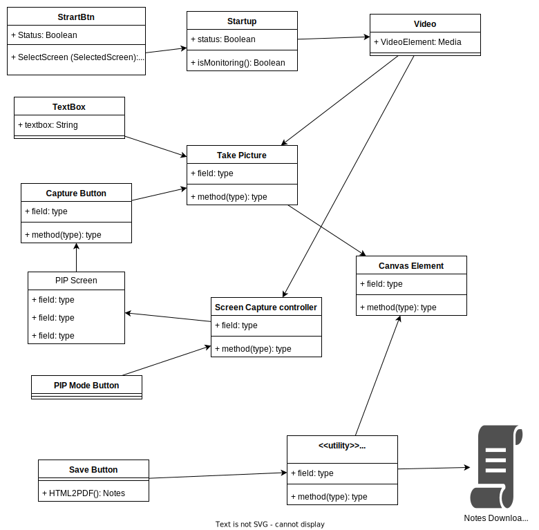
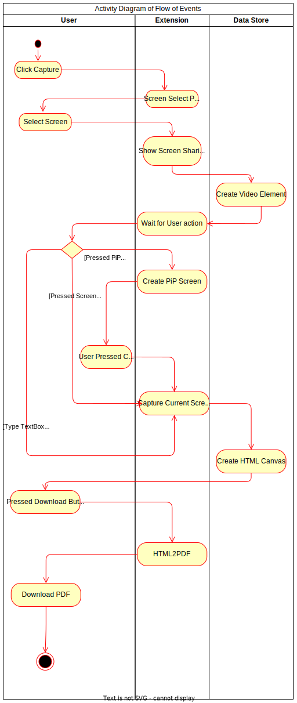

**Note:-** The document is confidential and is only meant for the user with whom author share it directly. This document along with its other dependent documents, contains all the required information that used in the development of the product. Don't share this document without the consent of the author.

# Full Documentation
## For Snap-Desk Extension

Version: **1.10.0**  
Prepared by: **Tejas Jain**  
Contact: 1tejasjain@gmail.com  
Date Created: **September 02, 2023**

Documentation Structure
=================
* 1 [Requirement Analysis](#1-requirement-phase)
  * 1.1 [Use Case Diagram & Description](#1-requirement-phase)
  * 1.2 [Initial Requirement Specification](./1Requirement/IRS.md)
  * 1.2 [Software Requirement Specification](./1Requirement/SRS.md)
* 2 [Analysis Phase(Object Oriented Analysis)](#2-analysis-diagrams)
  * 2.1 [Class Diagram](#21-class-diagram)
  * 2.2 [Class Description](#22-class-description)
  * 2.3 [Detailed Class Diagrams](#23-detailed-class-diagram)
* 3 [Design Phase](#3-design-diagrams)
  * 3.1 [Sequence Diagram](#sequence-diagram)
  * 3.2 [Collaboration Diagram](#collaboration-diagram)
* 4 [Implementation Phase](#4-implementation-diagrams)
  * 4.1 [Activity Diagram](#activity-diagram)
  <!-- * 4.2 [State Chart Diagram](#State-ChartDiagram) -->

# 1. Requirement Phase
## 1.1 Uses Case Diagram

## 1.2 Use Case Description
* [UC001 Select Screen Use Case](./1Requirement/UseCaseDesc.md#select-screen-use-case)
* [UC002 Capture Note Use Case](./1Requirement/UseCaseDesc.md#capture-screen-use-case)
* [UC003 Picture-in-Picture Mode Use Case](./1Requirement/UseCaseDesc.md#go-picture-in-picture-mode)
* [UC004 Text Note Use Case](./1Requirement/UseCaseDesc.md#text-box-use-case)
* [UC005 Download PDF Use Case](./1Requirement/UseCaseDesc.md#download-pdf-use-case)

# 2. Analysis Diagrams
## 2.1 Class Diagram

## 2.2 Class Description
| Class Name | Class Type | Class Description |
| :------------- | :------------- | :------------- |
| Capture Button | Interface | This class clicks the current user screen as canvas element |
| PIP Mode Buttton | Interface | This class initiates picture and picture mode of the current video element  having current screen as stream |
| PIP Screen | Interface | Class which shows current video element in small overlapping screen with the button to capture the screen. |
| Download Notes Button| Interface | Class to download all the screen along with their text notes as PDF |
| Start Monitoring | Controller | Class which starts the necessary procedures with calling to the necessary function and screen select prompt |
| Video Element | Entity | Class to store the current stream of desktop screen. |
| Take Picture | Controller | Class to combine Video Class and Text Box content to be saved as PDF |
| PIP Screen Controller | Controller | Class to Sync the video element with the PIP screen |
| Notes on Canvas Element | Entity | Class to store the Capture Screen along with the Text on HTML Canvas |
| HTML2PDF | Utility | Externally embeded Class which converts HTML Canvas to PDF |

## 2.3 Detailed Class Diagram

# 3. Design Diagrams
## Sequence Diagram

## Collaboration Diagram
Coming Soon...

# 4. Implementation Diagrams
## Activity Diagram
